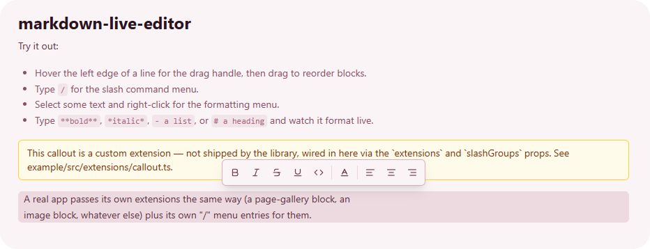

# markdown-live-editor

A live, WYSIWYG-style markdown editor built on [Tiptap](https://tiptap.dev)/ProseMirror — real block elements (headings, paragraphs, lists, tables) instead of a plain-text buffer with syntax hidden/revealed via decorations. The document round-trips to/from a plain markdown string.

Ships **no embeds of its own** — page galleries, images, custom blocks, whatever else, are entirely up to whatever app uses this. Bring your own Tiptap node extensions via the `extensions` prop, and your own extra "/" slash-menu entries for them via `slashGroups`.

## What's included

- A Notion-style hover handle for drag-to-reorder blocks, with a cursor-following ghost preview.
- A "/" slash command menu (built-in text formatting defaults: headings, bold/italic, lists, quote, code, divider, table).
- A floating formatting card (bold/italic/strike/code) that appears above the selection as soon as text is selected.
- A placeholder ("New Page") shown only when the whole document is empty.
- A fix for a real Tiptap quirk: input rules (`**bold**`, `- list`, etc.) don't fire reliably when this editor is nested inside another instance's own custom node (e.g. a "card" embed whose content is itself a nested editor) — `inputRuleRelay.ts` works around it.

## Usage

```tsx
import { MarkdownLiveEditor } from "markdown-live-editor";

function MyPage() {
  const [content, setContent] = useState("# Hello");
  return (
    <MarkdownLiveEditor
      content={content}
      onChange={setContent}
      extensions={[MyCustomEmbedNode]} // your own Tiptap nodes, if any
      slashGroups={[myCustomSlashGroup]} // your own "/" menu entries for them
      styles={{ h1: "text-3xl font-bold" }} // override any of the defaults
    />
  );
}
```

Anything a custom embed node needs at render time (ids, callbacks, app data) is entirely up to the consumer — e.g. wrap `<MarkdownLiveEditor>` in your own React Context provider. Tiptap NodeView portals render inside the same React tree this component renders in, so context from an ancestor of `<MarkdownLiveEditor>` is visible inside them.

## Extensions and the slash menu

The editor ships with a standard set of nodes (headings, lists, tables, quote, code, divider) and nothing else — anything beyond that is a regular Tiptap node extension you bring yourself via `extensions`, the same way you'd add one to any Tiptap editor. `example/src/extensions/callout.tsx` is a complete, minimal one worth reading end to end; the shape is:

- **`group: "block"` + `atom: true`** on the node — that alone is enough for it to get a drag handle, hover state, drag-reordering, and the selection-highlight ring for free. Nothing in the editor special-cases node types; the block-chrome machinery just walks the document's top-level nodes generically.
- **How it renders** — either a plain `renderHTML` DOM-spec (see `headingNode.ts` for the simplest form) if the node is just static markup, or `addNodeView()` with `ReactNodeViewRenderer` if it needs real interactivity (buttons, editable fields, anything a NodeView can host). `embedDomSpec(dataType)` (exported from this package) gives you the `parseHTML`/`renderHTML` fallback a NodeView-rendered node still needs for paths that don't go through the NodeView, like copy/paste.
- **How it round-trips through markdown** — a node needs `parseMarkdown`/`renderMarkdown` (or the `markdown` spec helpers `@tiptap/core` exports, like `createAtomBlockMarkdownSpec`) so `editor.getMarkdown()` and markdown-mode content loading both know what to do with it. `fencedJsonMarkdown(lang, nodeName)` (also exported from this package) is a ready-made version of this for embeds that just need to round-trip a JSON attrs blob through a fenced code block.

A minimal version with no interactivity — just static markup driven by attrs, the same pattern `headingNode.ts` uses:

```ts
// callout.ts
import { Node, mergeAttributes, createAtomBlockMarkdownSpec } from "@tiptap/core";

export const Callout = Node.create({
  name: "callout",
  group: "block",
  atom: true,
  addAttributes() {
    return { text: { default: "Note" } };
  },
  parseHTML() {
    return [{ tag: 'div[data-type="callout"]' }];
  },
  renderHTML({ HTMLAttributes, node }) {
    return [
      "div",
      mergeAttributes(HTMLAttributes, { "data-type": "callout", class: "rounded-md border p-2" }),
      node.attrs.text as string,
    ];
  },
  // Round-trips as `:::callout {text="..."} :::` — see @tiptap/core's docs
  // for this helper's Pandoc-style syntax.
  ...createAtomBlockMarkdownSpec({
    nodeName: "callout",
    defaultAttributes: { text: "Note" },
    allowedAttributes: ["text"],
  }),
});
```

If it needs real interactivity instead (an editable field, a button, anything React), swap `renderHTML` for a NodeView and keep `embedDomSpec` as the fallback schema needs regardless:

```tsx
// callout.tsx
import { Node, createAtomBlockMarkdownSpec } from "@tiptap/core";
import { NodeViewWrapper, ReactNodeViewRenderer, type NodeViewProps } from "@tiptap/react";
import { embedDomSpec } from "markdown-live-editor";

function CalloutView({ node }: NodeViewProps) {
  return <NodeViewWrapper data-type="callout" className="rounded-md border p-2">{node.attrs.text}</NodeViewWrapper>;
}

export const Callout = Node.create({
  name: "callout",
  group: "block",
  atom: true,
  addAttributes() {
    return { text: { default: "Note" } };
  },
  ...embedDomSpec("callout"),
  addNodeView() {
    return ReactNodeViewRenderer(CalloutView);
  },
  ...createAtomBlockMarkdownSpec({
    nodeName: "callout",
    defaultAttributes: { text: "Note" },
    allowedAttributes: ["text"],
  }),
});
```

A node existing in the schema doesn't put it in the "/" menu — that's `slashGroups`, a separate list of `{ section, blocks: [{ label, markdown, icon }] }` groups appended after the built-in ones (`DEFAULT_SLASH_GROUPS`, also exported). Picking an entry just inserts its `markdown` string through the same markdown-mode parser as everything else, so `markdown` needs to be whatever your node's `parseMarkdown` actually recognizes — a plain string normally, or a function returning a fresh string per insertion if the node needs its own generated id (an embed that needs a unique identity per instance, for example):

```tsx
import { MarkdownLiveEditor, type SlashGroup } from "markdown-live-editor";
import { MessageSquareText } from "lucide-react";
import { Callout } from "./extensions/callout";

const EXTRA_SLASH_GROUPS: SlashGroup[] = [
  {
    section: "Custom",
    blocks: [
      { label: "Callout", markdown: ':::callout {text="Note"} :::', icon: MessageSquareText },
    ],
  },
];

<MarkdownLiveEditor
  content={content}
  onChange={setContent}
  extensions={[Callout]}
  slashGroups={EXTRA_SLASH_GROUPS}
/>
```

## Theming

`theme` accepts either a built-in theme name (`"zinc"` — the default — `"mauve"`, `"indigo"`, `"slate"`, `"mist"`; all exported together as `MARKDOWN_LIVE_THEMES`) or a partial `MarkdownLiveTheme` object of your own, merged over the `zinc` base via `mergeTheme` (also exported, in case you want to do that merge yourself). Every built-in theme handles light *and* dark mode itself, via Tailwind `dark:` variants baked directly into its own classes — there's no separate "light theme"/"dark theme" pair, just a `.dark` class toggled somewhere up the tree.

```tsx
// by name
<MarkdownLiveEditor content={content} onChange={setContent} theme="mauve" />

// tweak one piece of a built-in theme without redefining the rest —
// merged over "zinc" (the default) since `theme` is omitted here
<MarkdownLiveEditor
  content={content}
  onChange={setContent}
  theme={{ blockSelection: "ring-2 ring-emerald-500/40 bg-emerald-500/10" }}
/>
```

A theme is a few distinct pieces, all in `MarkdownLiveTheme`:

- **`markdown`** (`MarkdownLiveStyles`) — one Tailwind class string per markdown element (`p`, `h1`/`h2`/`h3`, `ul`/`ol`/`li`, `blockquote`, `code`, `table`/`tr`/`th`/`td`, ...). This is what the `styles` prop overrides piecemeal — e.g. `styles={{ h1: "text-3xl font-bold" }}` — without having to redefine anything else.
- **`menu`** (`MarkdownLiveMenuStyles`) — the chrome for the floating selection toolbar and the "/" menu: `background`/`border`/`text`, `button`/`buttonActive`, `separator`, `activeRing`. Kept separate from `markdown` since it's UI chrome, not document content.
- **`handle`**, **`ghost`**, **`blockSelection`** — the drag handle's icon color, the drag-ghost preview's colors, and the block-selection highlight ring/background, respectively.
- **`textColors`** / **`highlightColors`** / **`swatch`** — the fixed color palettes offered in the text/background color pickers, and a single representative color for the theme itself (used e.g. by the example app's theme switcher).

A theme built from scratch (as opposed to overriding a built-in one) has to fill in every one of those pieces — there's no `DEFAULT_THEME` any partial object silently falls back to beyond what `mergeTheme` merges in from `zinc`:

```ts
import type { MarkdownLiveTheme } from "markdown-live-editor";

export const MY_THEME: MarkdownLiveTheme = {
  markdown: {
    content: "outline-none text-sm leading-relaxed py-6 text-slate-800 dark:text-slate-200",
    p: "mb-4 last:mb-0", strong: "font-semibold", em: "italic",
    h1: "text-2xl font-bold mb-2", h2: "text-lg font-bold mt-6 mb-1", h3: "font-bold mt-6",
    hr: "border-0 h-px bg-slate-300 mb-3 mt-2", code: "rounded bg-slate-500/10 px-1 py-0.5 font-mono text-xs",
    blockquote: "border-l-2 border-slate-300 pl-3 italic mb-4",
    ul: "list-disc pl-6 mb-4", ol: "list-decimal pl-12 mb-2", li: "leading-snug",
    table: "w-full border-collapse text-sm", tr: "border-b border-slate-300",
    th: "text-left px-2 py-1.5 font-semibold", td: "px-2 py-1.5 align-top",
  },
  menu: {
    background: "bg-white", border: "border-slate-300", text: "text-slate-800",
    button: "hover:bg-slate-500/10!", buttonActive: "bg-slate-500/15! border-slate-400!",
    separator: "bg-slate-300", activeRing: "ring-1! ring-slate-600!",
  },
  handle: "text-slate-400 hover:text-slate-700",
  ghost: "bg-white text-slate-700",
  blockSelection: "ring-2 ring-slate-500/40 bg-slate-500/10",
  textColors: ["#334155", "#dc2626", "#16a34a", "#2563eb"],
  highlightColors: ["#e2e8f0", "#fecaca", "#bbf7d0", "#bfdbfe"],
  swatch: "#64748b",
};
```

Internally, each built-in theme's `markdown` and most of its `handle`/`ghost`/`blockSelection` values are generated from a much smaller `MarkdownPalette` (a handful of semantic color roles — `text`, `textImportant`, `textMuted`, `accent`, `border`, ...) via a shared `buildMarkdownStyles` helper in `src/themes/buildTheme.ts` — see any file in `src/themes/definitions/` for the pattern. That helper isn't part of the public API; it's how the built-in themes stay consistent with each other, not something you need to touch to define your own theme object from scratch.

## Developing

This is a pnpm workspace: the library itself at the repo root, plus an `example/` app for interactively testing changes.

```sh
pnpm install
pnpm --filter example dev
```

Edits to `src/` hot-reload straight into the example app — no build/link step needed during development.

## Publishing

Not yet built for distribution — `main`/`types` currently point straight at `src/`, which works for a workspace consumer (Vite/bundler-mode resolution transpiles it directly) but isn't what you'd want published to npm. Add a build step (`tsup` or Vite library mode) emitting `dist/` before `npm publish`.
